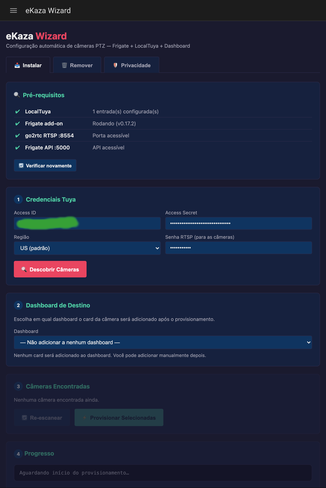
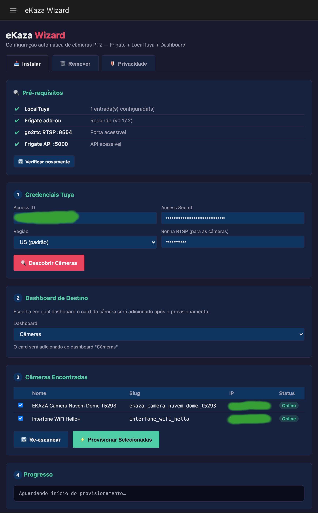
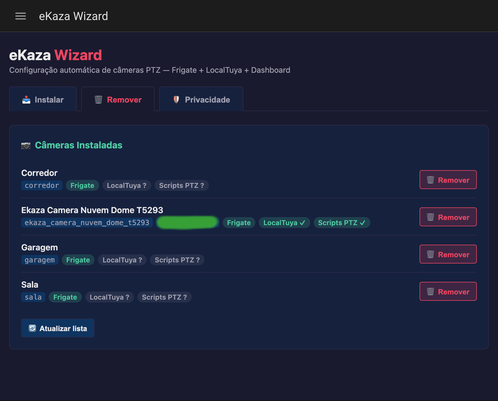
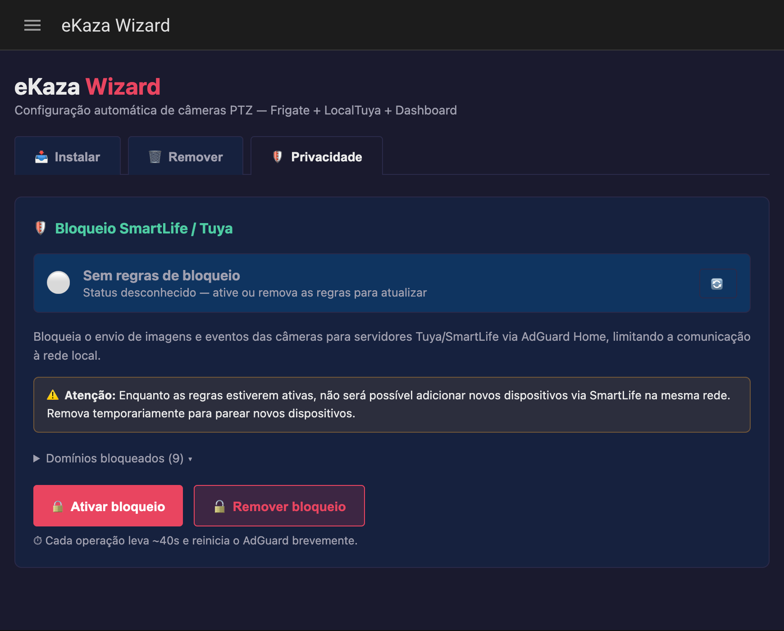

# eKaza Wizard

Integração para **[Home Assistant OS](https://www.home-assistant.io/installation/)** que automatiza o provisionamento completo de câmeras **[eKaza](https://www.ekaza.com.br)** em um stack local com Frigate + LocalTuya — do scan de rede até o dashboard, sem editar arquivos manualmente.

> ⚠️ **As câmeras eKaza devem ser adicionadas pelo aplicativo [Smart Life](https://smart-life-app.com/)** (Android/iOS), e **não** pelo app eKaza. O wizard usa a API Tuya vinculada à conta Smart Life para descobrir os dispositivos e obter as chaves locais necessárias para o controle local.

---

## Pré-requisitos

| Componente | Versão mínima | Por quê |
|---|---|---|
| **[Home Assistant OS](https://www.home-assistant.io/installation/)** | 2024.1+ | A integração usa a Supervisor API para ler/gravar configurações |
| **[Frigate](https://github.com/blakeblackshear/frigate)** | 0.13+ | Recebe os streams RTSP e faz detecção de objetos |
| **[LocalTuya](https://github.com/rospogrigio/localtuya)** | 6.0+ | Controla os DPs da câmera localmente (PTZ, gravação, LED etc.) |
| **[Conta Tuya IoT Platform](https://iot.tuya.com)** | — | Necessária para obter o `device_id` e a `local_key` das câmeras |

> LocalTuya é instalado via **[HACS](https://hacs.xyz)**.

**Opcional:**

| Componente | Para quê |
|---|---|
| **[AdGuard Home](https://github.com/hassio-addons/addon-adguard-home)** | Aba Privacidade — bloquear servidores Tuya/SmartLife; também necessário para o modo **câmera → Frigate** |

---

## Credenciais Tuya

> 📖 **Tutorial:** [Como criar uma conta de desenvolvedor Tuya e vincular ao Smart Life](https://developer.tuya.com/en/docs/iot/quick-start1?id=K95ztz9u9t89n)

1. Acesse [iot.tuya.com](https://iot.tuya.com) e crie uma conta de desenvolvedor gratuita
2. Crie um projeto em **Cloud → Development → Create Cloud Project** (tipo **Smart Home**)
3. Anote o **Access ID** e o **Access Secret** na aba **Overview** do projeto
4. Em **Devices → Link Tuya App Account**, vincule sua conta do **Smart Life** via QR code
5. Confirme a **região** onde seus dispositivos estão registrados (`us`, `eu`, `cn` ou `in`)

---

## Instalação via HACS

### 1. Adicionar repositório customizado

Em **HACS → Integrations → menu (⋮) → Custom repositories**, adicione:

```
https://github.com/felipearmat/ekaza-wizard
```

Tipo: **Integration**

### 2. Instalar

Pesquise **eKaza Wizard** no HACS e clique em **Download**. Reinicie o Home Assistant.

### 3. Configurar

Vá em **Settings → Integrations → Add integration → eKaza Wizard** e preencha as credenciais Tuya e a senha RTSP padrão das câmeras.

O wizard abre automaticamente no menu lateral após a configuração.

---

## Como usar

### Aba Instalar

**1. Verificar dependências**

Testa a comunicação com Frigate, LocalTuya e a API Tuya antes de prosseguir.

**2. Descobrir câmeras**

Clique em **Descobrir câmeras**. O wizard:
- Consulta a API Tuya Cloud para listar dispositivos da conta
- Faz scan de rede local (tinytuya broadcast) para obter IP e `local_key`
- Filtra pela categoria Tuya (`sp`/`ipc`) e presença de DPs de câmera
- Busca os DPs via `/v1.1/devices/{id}/specifications` — sem depender de `product_id`

**3. Provisionar**

Selecione as câmeras, ajuste os nomes e clique em **Provisionar**. O wizard executa:

| Etapa | O que faz |
|---|---|
| **ONVIF** | Ativa ONVIF (DP 237) e define senha RTSP (DP 238) via LocalTuya |
| **Frigate** | Adiciona stream go2rtc + bloco de câmera no config do Frigate e reinicia |
| **LocalTuya** | Cria config entry com ~20 switches, 10 selects, 2 numbers (PTZ, LED, zoom, gravação etc.) |
| **Scripts PTZ** | Gera scripts `ptz_up/down/left/right/home` + `zoom_in/out` |
| **Motion Bridge** | Monitora DP de movimento da câmera e dispara eventos no Frigate |
| **Dashboard** | Adiciona card da câmera no dashboard Lovelace selecionado |
| **Proxy MITM** *(câmera → Frigate)* | Veja abaixo |

---

### Modo câmera → Frigate (detecção via IA embarcada)

Por padrão, o Frigate usa seu próprio modelo de ML para detectar objetos (modo **Frigate**). O modo **câmera → Frigate** é uma alternativa que usa a **IA embarcada da câmera** para detectar movimento, eliminando o custo de CPU no servidor.

#### Como funciona

A câmera envia alertas de movimento ao Tuya Cloud via MQTT sobre TLS (porta 8883). O wizard instala um **proxy MITM transparente** que intercepta essa conexão:

```
Câmera → [AdGuard redireciona DNS] → Proxy MITM (HA) → Tuya Cloud
                                            │
                                     detecta DP 185 (alarm_message)
                                            │
                                     POST /api/events/{slug}/motion/create
                                            │
                                     Frigate grava clip ✓
```

O proxy usa um certificado TLS auto-assinado gerado dinamicamente via SNI. Como câmeras IoT Tuya raramente validam a cadeia de certificados, a conexão é aceita. O tráfego é integralmente repassado ao Tuya Cloud real — as notificações no Smart Life continuam funcionando.

#### Pré-requisito

**AdGuard Home** instalado e acessível. Usado para redirecionar o domínio MQTT da Tuya para o IP do HA.

#### Ativar no provisionamento

No wizard, ao provisionar uma câmera, marque **câmera → Frigate** na lista. O wizard:
1. Auto-descobre o domínio MQTT da câmera (via log AdGuard ou probe TCP)
2. Adiciona DNS rewrite no AdGuard: `m.tuyaus.com → {HA IP}`
3. Inicia o proxy na porta 8883
4. Configura o Frigate sem ML detection para esta câmera (economia de CPU)

#### Ativar / desativar depois do provisionamento

Via API REST (sem reprovisionamento):

```bash
# Ativar proxy para uma câmera
curl -X POST http://{HA}:8123/api/ekaza_wizard/proxy/toggle \
  -H "Content-Type: application/json" \
  -d '{"slug": "nome_camera", "enable": true}'

# Desativar
curl -X POST http://{HA}:8123/api/ekaza_wizard/proxy/toggle \
  -H "Content-Type: application/json" \
  -d '{"slug": "nome_camera", "enable": false}'

# Ver estado atual
curl http://{HA}:8123/api/ekaza_wizard/proxy/status
```

#### Modos de detecção disponíveis

| Modo | Como ativar | Detecção | CPU no servidor |
|---|---|---|---|
| **Frigate** (padrão) | `proxy_enabled: false` | ML Frigate | Alto (modelos YOLO) |
| **câmera → Frigate** | `proxy_enabled: true` | IA embarcada na câmera | Mínimo |

> **Nota:** Se a câmera valida a cadeia de certificados TLS do broker MQTT (incomum em câmeras IoT baratas), o proxy não conseguirá interceptar a conexão e a câmera continuará enviando eventos somente ao Tuya Cloud.

---

### Aba Remover

Lista as câmeras configuradas no Frigate. Para cada câmera selecionada, **desfaz todas as etapas de provisionamento**:

- Remove streams go2rtc e bloco da câmera no Frigate (reinicia o Frigate)
- Remove config entry do LocalTuya
- Apaga scripts PTZ
- Remove motion bridge e `input_boolean` associado
- Remove card do dashboard Lovelace

---

### Aba Privacidade

Gerencia o bloqueio das câmeras à nuvem Tuya/SmartLife via **AdGuard Home**.

O AdGuard expõe sua API apenas em `localhost`, inacessível de fora. A integração usa a **Supervisor Backup API** como contorno:

1. Cria backup parcial do AdGuard
2. Extrai e modifica `AdGuardHome.yaml` em memória (adiciona/remove bloco de regras DNS)
3. Faz upload do backup modificado e restaura — AdGuard reinicia com as novas regras

A operação leva ~40 segundos.

**Domínios bloqueados:**

```
tuya.com  tuyaeu.com  tuyacn.com  tuyaus.com  tuyain.com
smart-life.com  smartlifeapp.com  fogcloud.io  nebulae-iot.com
```

> ⚠️ Com o bloqueio ativo não é possível parear novos dispositivos via Smart Life na mesma rede. Desative temporariamente para parear e reative em seguida.

---

## Câmeras compatíveis

O wizard detecta câmeras pela **categoria Tuya** (`sp`/`ipc`) e pelas **capacidades do dispositivo** — sem depender de `product_id`.

| Modelo | Tipo | Status |
|---|---|---|
| eKaza EKRW-T5293 | Dome PTZ | ✅ Testado com hardware físico |
| eKaza EKRW-T5394 | Dome PTZ | 🔍 Suportado — aguardando confirmação |
| eKaza EKGD-T4117 | Câmera externa | 🔍 Suportado — aguardando confirmação |
| eKaza EKGD-T5530 | Câmera externa | 🔍 Suportado — aguardando confirmação |
| eKaza EKGD-T2233 | Câmera externa | 🔍 Suportado — aguardando confirmação |
| eKaza EKJS-T3188 | Câmera interna | 🔍 Suportado — aguardando confirmação |
| eKaza EKJS-T3169 | Câmera interna | 🔍 Suportado — aguardando confirmação |

> Câmeras de outros fabricantes baseadas em Tuya (`sp`/`ipc`) também podem ser detectadas. Abra uma [issue](https://github.com/felipearmat/ekaza-wizard/issues) para reportar compatibilidade.

---

## Screenshots

<table>
<tr>
  <td align="center"><b>Aba Instalar — descoberta de câmeras</b><br></td>
  <td align="center"><b>Log de provisionamento em tempo real</b><br></td>
</tr>
<tr>
  <td align="center"><b>Aba Remover</b><br></td>
  <td align="center"><b>Aba Privacidade — bloqueio AdGuard</b><br></td>
</tr>
</table>

---

## Licença

MIT

---

## Créditos

Desenvolvido com o auxílio do [Claude](https://claude.ai) (Anthropic), supervisionado em todas as etapas e validado com equipamentos físicos em ambiente local.
